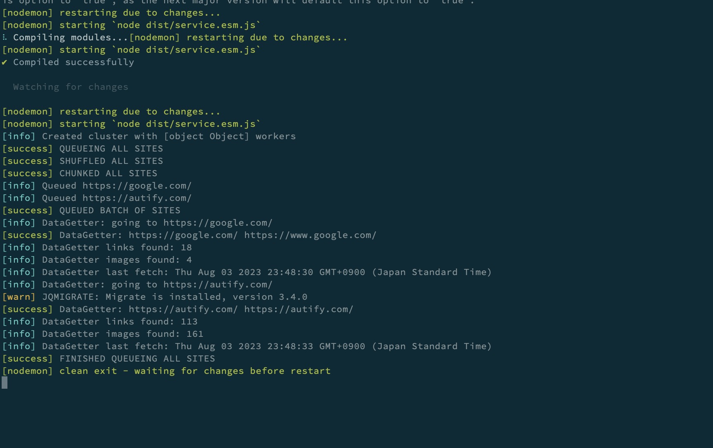

# Automatic Site Crawling with Puppeteer

Sample project for retrieving and saving .html pages of sites and keep assets/structure of page.

## About

We are using puppeteer and cluster with puppeteer to great a queue of sites to crawl and post meta data from each site that is stored within the `saved_sites` directory.

## How to use

Node version used is 16.

1. Edit `src/lib/sites.ts` and list all sites you want to crawler
2. You can run a build and start the crawler or run in development mode in yarn or npm - e.g. `npm start`
3. See both images and full html pages stored under `saved_sites` directory

Choose to run the clusters in `headless` mode or not under the `cluster.ts` direcrory.

